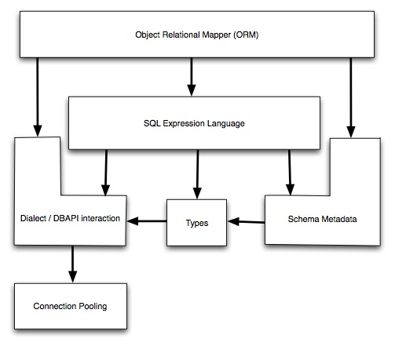

.. _overview_toplevel:

=======================
Overview / Installation
=======================

Overview
========

The SQLAlchemy SQL Toolkit and Object Relational Mapper is a comprehensive set of tools for working with databases and Python.  It has several distinct areas of functionality which can be used individually or combined together.  Its major components are illustrated below.  The arrows represent the general dependencies of components:

Above, the two most significant front-facing portions of SQLAlchemy are the **Object Relational Mapper** and the **SQL Expression Language**.  SQL Expressions can be used independently of the ORM.  When using the ORM, the SQL Expression language remains part of the public facing API as it is used within object-relational configurations and queries.

Tutorials
=========

* :ref:`ormtutorial_toplevel` - This describes the richest feature of SQLAlchemy, its object relational mapper.  If you want to work with higher-level SQL which is constructed automatically for you, as well as management of Python objects, proceed to this tutorial.
* :ref:`sqlexpression_toplevel` - The core of SQLAlchemy is its SQL expression language.  The SQL Expression Language is a toolkit all its own, independent of the ORM package, which can be used to construct manipulable SQL expressions which can be programmatically constructed, modified, and executed, returning cursor-like result sets.  It's a lot more lightweight than the ORM and is appropriate for higher scaling SQL operations.  It's also heavily present within the ORM's public facing API, so advanced ORM users will want to master this language as well.

Main Documentation
==================

* :ref:`datamapping_toplevel` - A comprehensive walkthrough of major ORM patterns and techniques.
* :ref:`session_toplevel` - A detailed description of SQLAlchemy's Session object
* :ref:`engines_toplevel` - Describes SQLAlchemy's database-connection facilities, including connection documentation and working with connections and transactions.
* :ref:`metadata_toplevel` - All about schema management using :class:`~sqlalchemy.schema.MetaData` and :class:`~sqlalchemy.schema.Table` objects; reading database schemas into your application, creating and dropping tables, constraints, defaults, sequences, indexes.
* :ref:`pooling_toplevel` - Further detail about SQLAlchemy's connection pool library.
* :ref:`types` - Datatypes included with SQLAlchemy, their functions, as well as how to create your own types.
* :ref:`plugins` - Included addons for SQLAlchemy

Code Examples
=============

Working code examples are included in the SQLAlchemy distribution, and there are also usage recipes on the SQLAlchemy wiki.   A description of all the included example applications is at :ref:`examples_toplevel`.

API Reference
=============

An organized section of all SQLAlchemy APIs is at :ref:`api_reference_toplevel`.

Installing SQLAlchemy
======================

Installing SQLAlchemy from scratch is most easily achieved with `setuptools <http://pypi.python.org/pypi/setuptools/>`_. Assuming it's installed, just run this from the command-line:

.. sourcecode:: none

    # easy_install SQLAlchemy

This command will download the latest version of SQLAlchemy from the `Python Cheese Shop <http://pypi.python.org/pypi/SQLAlchemy>`_ and install it to your system.

* setuptools_ 
* `install setuptools <http://peak.telecommunity.com/DevCenter/EasyInstall#installation-instructions>`_
* `pypi <http://pypi.python.org/pypi/SQLAlchemy>`_

Otherwise, you can install from the distribution using the ``setup.py`` script:

.. sourcecode:: none

    # python setup.py install

Installing a Database API
==========================

SQLAlchemy is designed to operate with a `DB-API <http://www.python.org/doc/peps/pep-0249/>`_ implementation built for a particular database, and includes support for the most popular databases.  The current list is at :ref:`supported_dbapis`.

Checking the Installed SQLAlchemy Version
=========================================

This documentation covers SQLAlchemy version 0.6.  If you're working on a system that already has SQLAlchemy installed, check the version from your Python prompt like this:

.. sourcecode:: python+sql

     >>> import sqlalchemy
     >>> sqlalchemy.__version__ # doctest: +SKIP
     0.6.0

0.5 to 0.6 Migration
=====================

Notes on what's changed from 0.5 to 0.6 is available on the SQLAlchemy wiki at `06Migration <http://www.sqlalchemy.org/trac/wiki/06Migration>`_.
