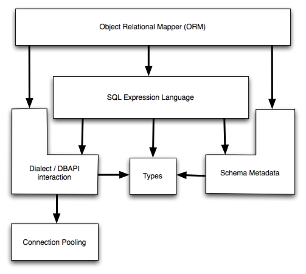

.. _overview_toplevel:

========
Overview
========

.. _overview:

Overview
========

The SQLAlchemy SQL Toolkit and Object Relational Mapper
is a comprehensive set of tools for working with
databases and Python. It has several distinct areas of
functionality which can be used individually or combined
together. Its major components are illustrated in below,
with component dependencies organized into layers:

Above, the two most significant front-facing portions of
SQLAlchemy are the **Object Relational Mapper** and the
**SQL Expression Language**. SQL Expressions can be used
independently of the ORM. When using the ORM, the SQL
Expression language remains part of the public facing API
as it is used within object-relational configurations and
queries.

.. _doc_overview:

Documentation Overview
======================

The documentation is separated into three sections: :ref:`orm_toplevel`,
:ref:`core_toplevel`, and :ref:`dialect_toplevel`.

In :ref:`orm_toplevel`, the Object Relational Mapper is introduced and fully
described. New users should begin with the :ref:`ormtutorial_toplevel`. If you
want to work with higher-level SQL which is constructed automatically for you,
as well as management of Python objects, proceed to this tutorial.

In :ref:`core_toplevel`, the breadth of SQLAlchemy's SQL and database
integration and description services are documented, the core of which is the
SQL Expression language. The SQL Expression Language is a toolkit all its own,
independent of the ORM package, which can be used to construct manipulable SQL
expressions which can be programmatically constructed, modified, and executed,
returning cursor-like result sets. In contrast to the ORM's domain-centric
mode of usage, the expression language provides a schema-centric usage
paradigm. New users should begin here with :ref:`sqlexpression_toplevel`.
SQLAlchemy engine, connection, and pooling services are also described in
:ref:`core_toplevel`.

In :ref:`dialect_toplevel`, reference documentation for all provided
database and DBAPI backends is provided.

Code Examples
=============

Working code examples, mostly regarding the ORM, are included in the
SQLAlchemy distribution. A description of all the included example
applications is at :ref:`examples_toplevel`.

There is also a wide variety of examples involving both core SQLAlchemy
constructs as well as the ORM on the wiki.  See
`Theatrum Chemicum <http://www.sqlalchemy.org/trac/wiki/UsageRecipes>`_.

.. _installation:

Installation Guide
==================

Supported Platforms
-------------------

SQLAlchemy has been tested against the following platforms:

* cPython since version 2.4, through the 2.xx series
* cPython version 3, throughout all 3.xx series
* `Jython <http://www.jython.org/>`_ 2.5 or greater
* `Pypy <http://pypy.org/>`_ 1.5 or greater

Supported Installation Methods
-------------------------------

SQLAlchemy supports installation using standard Python "distutils" or
"setuptools" methodologies. An overview of potential setups is as follows:

* **Plain Python Distutils** - SQLAlchemy can be installed with a clean
  Python install using the services provided via `Python Distutils <http://docs.python.org/distutils/>`_,
  using the ``setup.py`` script. The C extensions as well as Python 3 builds are supported.
* **Standard Setuptools** - When using `setuptools <http://pypi.python.org/pypi/setuptools/>`_, 
  SQLAlchemy can be installed via ``setup.py`` or ``easy_install``, and the C
  extensions are supported.  setuptools is not supported on Python 3 at the time
  of of this writing.
* **Distribute** - With `distribute <http://pypi.python.org/pypi/distribute/>`_, 
  SQLAlchemy can be installed via ``setup.py`` or ``easy_install``, and the C
  extensions as well as Python 3 builds are supported.
* **pip** - `pip <http://pypi.python.org/pypi/pip/>`_ is an installer that
  rides on top of ``setuptools`` or ``distribute``, replacing the usage
  of ``easy_install``.  It is often preferred for its simpler mode of usage.

.. note:: 

   It is strongly recommended that either ``setuptools`` or ``distribute`` be installed.
   Python's built-in ``distutils`` lacks many widely used installation features.

Install via easy_install or pip
-------------------------------

When ``easy_install`` or ``pip`` is available, the distribution can be 
downloaded from Pypi and installed in one step::

    easy_install SQLAlchemy

Or with pip::

    pip install SQLAlchemy

This command will download the latest version of SQLAlchemy from the `Python
Cheese Shop <http://pypi.python.org/pypi/SQLAlchemy>`_ and install it to your system.

Installing using setup.py
----------------------------------

Otherwise, you can install from the distribution using the ``setup.py`` script::

    python setup.py install

Installing the C Extensions
----------------------------------

SQLAlchemy includes C extensions which provide an extra speed boost for
dealing with result sets. Currently, the extensions are only supported on the
2.xx series of cPython, not Python 3 or Pypy.

setup.py will automatically build the extensions if an appropriate platform is
detected. If the build of the C extensions fails, due to missing compiler or
other issue, the setup process will output a warning message, and re-run the
build without the C extensions, upon completion reporting final status.

To run the build/install without even attempting to compile the C extensions,
pass the flag ``--without-cextensions`` to the ``setup.py`` script::

    python setup.py --without-cextensions install

.. note:: 

   The ``--without-cextensions`` flag is available **only** if ``setuptools``
   or ``distribute`` is installed.  It is not available on a plain Python ``distutils``
   installation.  The library will still install without the C extensions if they
   cannot be built, however.

Installing on Python 3
----------------------------------

SQLAlchemy ships as Python 2 code. For Python 3 usage, the ``setup.py`` script
will invoke the Python ``2to3`` tool on the build, plugging in an extra
"preprocessor" as well. The 2to3 step works with Python distutils
(part of the standard Python install) and Distribute - it will **not**
work with a non-Distribute setuptools installation.

Installing a Database API
----------------------------------

SQLAlchemy is designed to operate with a `DB-API
<http://www.python.org/doc/peps/pep-0249/>`_ implementation built for a
particular database, and includes support for the most popular databases. The
current list is at :ref:`supported_dbapis`.

Checking the Installed SQLAlchemy Version
------------------------------------------

This documentation covers SQLAlchemy version 0.7. If you're working on a
system that already has SQLAlchemy installed, check the version from your
Python prompt like this:

.. sourcecode:: python+sql

     >>> import sqlalchemy
     >>> sqlalchemy.__version__ # doctest: +SKIP
     0.7.0

.. _migration:

0.6 to 0.7 Migration
=====================

Notes on what's changed from 0.6 to 0.7 is available on the SQLAlchemy wiki at
`07Migration <http://www.sqlalchemy.org/trac/wiki/07Migration>`_.
